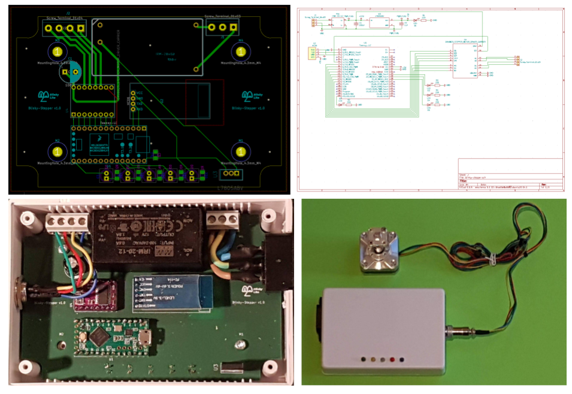

# Blinky Stepper Cube

 

The Blinky Stepper Cube is designed to drive 12V bi-polar stepper motors using the high current [DRV8825 Stepper Motor Driver Carrier](https://www.pololu.com/product/2133). The DRV8825 is driven by a [Teensy LC](https://www.pjrc.com/teensy/teensyLC.html) micro-controller. The Teensy LC micro-controller communicates to the [message tray](https://github.com/Blinky-Lite-Exchange/blinky-stepper-tray) with a serial Bluetooth connection very similar to the connection method described in the [Blinky Bus Cube](https://github.com/Blinky-Lite-Exchange/blinky-bus-cube) project.
